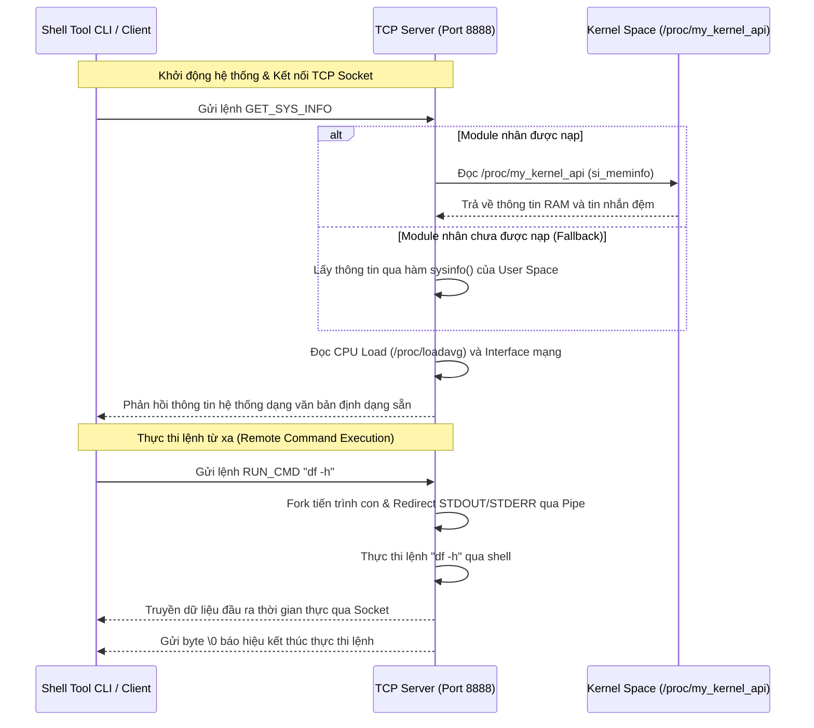

# Hệ thống Quản trị & Giám sát Linux (Kernel Module & Socket API)

Dự án này là một hệ thống quản trị hệ thống Linux tích hợp đa thành phần, kết hợp giữa lập trình nhân hệ điều hành (Kernel Space) và lập trình ứng dụng mạng/kịch bản quản trị (User Space). 

---

## 📋 Mục lục
1. [Tổng quan dự án](#-tổng-quan-dự-án)
2. [Cấu trúc thư mục](#-cấu trúc-thư-mục)
3. [Yêu cầu hệ thống](#-yêu-cầu-hệ-thống)
4. [Hướng dẫn Biên dịch & Cài đặt](#-hướng-dẫn-biên-dịch--cài-đặt)
5. [Hướng dẫn Sử dụng](#-hướng-dẫn-sử-dụng)
6. [Kịch bản Kiểm thử Tự động (Test Suite)](#-kịch-bản-kiểm-thử-tự-động-test-suite)
7. [Mô tả Chi tiết Luồng hoạt động](#-mô-tả-chi-tiết-luồng-hoạt-động)

---

## 🔍 Tổng quan dự án

Hệ thống bao gồm 3 thành phần cốt lõi:
1. **Linux Kernel Module (`kernel/`)**: Tạo một giao diện tệp ảo ảo `/proc/my_kernel_api` cho phép ghi dữ liệu tùy chỉnh từ User Space vào bộ đệm của Kernel, và đọc ngược lại thông tin bộ nhớ RAM trống từ cấu trúc nhân Linux thông qua hàm `si_meminfo()`.
2. **TCP Socket Server-Client (`socket/`)**: 
   - **Server**: Chạy ngầm trên cổng `8888`. Khi có yêu cầu `GET_SYS_INFO` từ client, nó sẽ đọc trực tiếp từ `/proc/my_kernel_api` (hoặc tự động fallback sang `sysinfo` nếu chưa nạp module), thu thập thông tin CPU Load (`/proc/loadavg`), và các giao tiếp mạng (IP Address). Nó cũng hỗ trợ ghi nhật ký hoạt động ra `server.log`, đọc nhật ký qua socket (`READ_LOG`), và thực thi lệnh hệ thống từ xa (`RUN_CMD`) thông qua cơ chế tạo tiến trình (`fork()`) kết hợp đường ống dẫn kênh chuẩn (`pipe()`).
   - **Client**: Nhận lệnh từ dòng lệnh hoặc Shell CLI gửi tới Server, nhận kết quả và hiển thị cho quản trị viên.
3. **Shell Tool CLI (`shell/`)**: Công cụ kịch bản tương tác trực quan cung cấp menu cho phép quản trị viên quản lý file/thư mục, lập lịch cron job, đồng bộ giờ hệ thống, quản lý gói phần mềm (apt), và kết nối giám sát từ xa thông qua TCP Client.

---

## 📁 Cấu trúc thư mục

```text
.
├── kernel/
│   ├── my_kernel_api.c   # Mã nguồn Kernel Module tạo file ảo /proc
│   └── Makefile          # Makefile để xây dựng Kernel Module
├── socket/
│   ├── server.c          # Mã nguồn TCP Server đa tác vụ
│   ├── client.c          # Mã nguồn TCP Client gửi lệnh
│   ├── common.h          # Định nghĩa giao thức & lệnh chung
│   └── Makefile          # Makefile biên dịch server và client
├── shell/
│   └── system_tool.sh    # Script CLI tương tác quản lý hệ thống
├── tests/
│   ├── test_suite.sh     # Kịch bản kiểm thử tích hợp tự động
│   └── ...               # Các kịch bản kiểm thử phụ trợ
├── Makefile              # Makefile tổng quản lý toàn bộ dự án
└── README.md             # Tài liệu hướng dẫn sử dụng (tệp này)
```

---

## 🛠️ Yêu cầu hệ thống

Hệ thống yêu cầu chạy trên môi trường Linux (khuyến nghị Debian/Ubuntu) và cần các công cụ biên dịch cơ bản:
* Bộ biên dịch `gcc` và công cụ `make` (Gói `build-essential`).
* Kernel Headers tương ứng với phiên bản Linux hiện tại (Gói `linux-headers-$(uname -r)`).
* Quyền quản trị tối cao (`sudo` / `root`) để nạp Kernel Module và chạy công cụ quản lý hệ thống.

Cài đặt các gói phụ thuộc trên Ubuntu/Debian:
```bash
sudo apt update
sudo apt install build-essential linux-headers-$(uname -r)
```

---

## ⚙️ Hướng dẫn Biên dịch & Cài đặt

Makefile ở thư mục gốc cung cấp các lệnh tiện lợi để biên dịch và quản lý dự án:

1. **Biên dịch tất cả** (biên dịch cả Kernel Module và Socket Server/Client):
   ```bash
   make
   ```
2. **Dọn dẹp tệp tin biên dịch trung gian**:
   ```bash
   make clean
   ```
3. **Nạp Kernel Module vào hệ thống**:
   ```bash
   make load
   ```
4. **Gỡ bỏ Kernel Module khỏi hệ thống**:
   ```bash
   make unload
   ```

---

## 🚀 Hướng dẫn Sử dụng

Để chạy toàn bộ hệ thống, hãy thực hiện theo thứ tự các bước sau đây:

### Bước 1: Biên dịch mã nguồn và nạp Kernel Module
```bash
# Biên dịch dự án
make

# Nạp module nhân hệ điều hành
make load

# Kiểm tra xem module đã nạp thành công chưa
lsmod | grep my_kernel_api

# Xem file ảo hoạt động thế nào bằng lệnh đọc thông tin
cat /proc/my_kernel_api
```

### Bước 2: Chạy TCP Socket Server
Mở một Terminal mới và chạy Server để lắng nghe kết nối từ Client:
```bash
# Chạy TCP Server
cd socket
./server
```
*Lưu ý:* Server sẽ tạo file `server.log` cùng thư mục để ghi nhận lịch sử các yêu cầu nhận được.

### Bước 3: Sử dụng Shell Tool quản trị hệ thống
Mở thêm một Terminal mới, di chuyển đến thư mục gốc của dự án và chạy công cụ với quyền `sudo`:
```bash
sudo ./shell/system_tool.sh
```

Giao diện Menu của ứng dụng:
```text
=========================================
  MENU QUẢN TRỊ HỆ THỐNG (SHELL TOOL)  
=========================================
1. Quản lý File
2. Lập lịch Tác vụ
3. Cấu hình Giờ Hệ thống
4. Quản lý Phần mềm
5. Giám sát & Điều khiển từ xa (TCP)
6. Thoát
=========================================
```
* Chọn các phím từ `1` đến `4` để thực hiện các chức năng quản trị cục bộ (quản lý file, thiết lập lịch chạy, cập nhật giờ, cài đặt gói ứng dụng).
* Chọn phím `5` để truy cập vào **Menu Giám sát & Điều khiển từ xa**:
  - **Lựa chọn 1**: Gửi lệnh `GET_SYS_INFO` để hiển thị trạng thái tài nguyên hệ thống (bao gồm thông tin RAM lấy trực tiếp từ Kernel Module `/proc/my_kernel_api`).
  - **Lựa chọn 2**: Gửi lệnh `READ_LOG` để đọc nội dung nhật ký hoạt động từ Server.
  - **Lựa chọn 3**: Gửi lệnh `RUN_CMD` để chạy một câu lệnh Shell bất kỳ trên Server từ xa (ví dụ: `uname -a`, `df -h`, `free -m`) và xem kết quả trả về thời gian thực.

---

## 🧪 Kịch bản Kiểm thử Tự động (Test Suite)

Dự án đi kèm một kịch bản kiểm thử tích hợp toàn diện nằm ở `tests/test_suite.sh`. Kịch bản này tự động hóa các thao tác:
1. Kiểm tra cấu trúc thư mục và sự hiện diện của các file mã nguồn.
2. Kiểm tra biên dịch.
3. Chạy thử nghiệm TCP Server ngầm.
4. Nạp Kernel Module và xác thực dữ liệu từ file `/proc/my_kernel_api`.
5. Mô phỏng Client kết nối gửi các lệnh giao thức (`GET_SYS_INFO`, `READ_LOG`, `RUN_CMD`, `EXIT`) và đối soát kết quả phản hồi.
6. Tự động tắt Server, gỡ bỏ Kernel Module và dọn dẹp sạch sẽ mã nguồn trung gian (Teardown).

Để chạy kịch bản kiểm thử:
```bash
sudo ./tests/test_suite.sh
```

---

## 🔄 Mô tả Chi tiết Luồng hoạt động



Giao thức truyền dữ liệu giữa Client và Server:
* Lệnh gửi từ Client bắt đầu bằng các hằng số giao thức (định nghĩa trong `socket/common.h`).
* Phản hồi thành công từ server bắt đầu bằng tiền tố `OK:` tiếp nối bởi dữ liệu trả về, kết thúc bằng ký tự `\0`.
* Phản hồi thất bại bắt đầu bằng tiền tố `ERROR:` đi kèm thông tin mô tả chi tiết lỗi.
